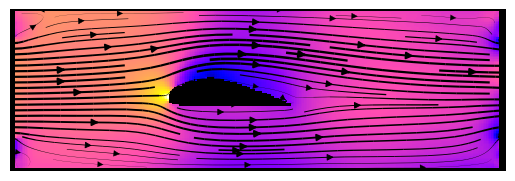
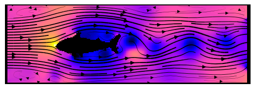
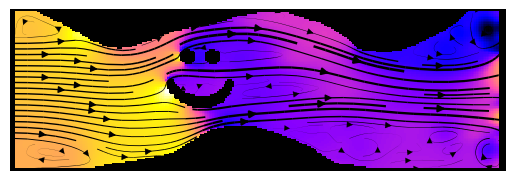

# Learning Incompressible Fluid Dynamics from Scratch
Towards Fast, Differentiable Fluid Models that Generalize





Hi!  
Do you want to generate some cool fluid simulations with CNNs?  
Do you want to train your own models to perform fluid simulations without having to worry about ground truth data?  
Then, this is the right repository for you! :)

In this project, we aim at learning different time integration schemes (explicit / implicit / IMEX) to solve the incompressible Navier Stokes equations on a Marker and Cell (MAC) grid using a U-Net.

## Publications

Comprehensive background information is provided in our paper:  
[Learning Incompressible Fluid Dynamics from Scratch - Towards Fast, Differentiable Fluid Models that Generalize](https://arxiv.org/abs/2006.08762)  
*Nils Wandel, Michael Weinmann, Reinhard Klein*, ICLR, 2021 ([Video](https://www.youtube.com/watch?v=EU3YuUNVsXQ))

Recently, we extended this work to 3D, so you might also want to check out:  
[Teaching the Incompressible Navier Stokes Equations to Fast Neural Surrogate Models in 3D](https://arxiv.org/abs/2012.11893)  
*Nils Wandel, Michael Weinmann, Reinhard Klein*, Physics of Fluids, 2021 ([Code](https://github.com/aschethor/Teaching_Incompressible_Fluid_Dynamics_to_3D_CNNs),[Video](https://www.youtube.com/watch?v=tKcYJaJtHJE))

## Installation

First, create a new Conda-environment:

```
conda create --name my_cool_fluid_env python=3.7  
source activate my_cool_fluid_env
```

Now, install the following packages:

```
conda install pytorch torchvision cudatoolkit=10.2 -c pytorch  
conda install matplotlib statsmodels natsort tensorboard  
pip install opencv-python
```

... and you're done :)  
The installation was tested on Ubuntu 18.04, but other operating systems should work as well. 
If you have troubles with cuda (e.g. because you don't have a GPU at hand), use the "\-\-cuda=f" option for all of the following python scripts.

## Interactive Demo and Visualization

We provide you with 2 pretrained models so you can directly "dive into" some fluid simulations: In the following, you can start to play around with our interactive demo and generate streamline plots :)

The first model was trained with mu=0.1, rho=4 and dt=4. To start the interactive fluid simulation, run:

```
python demo_interactive.py --mu=0.1 --rho=4 --dt=4
```

The second model was trained with mu=0.5, rho=1 and dt=4. To start the demo using this model, run:

```
python demo_interactive.py --mu=0.5 --rho=1 --dt=4
```

The obstacles follow the mouse if the left button is pressed.
By pressing 'x' or 'y' the flow can be accelerated or decelerated respectively and by tipping 'n' you can swap to a new randomly chosen fluid domain.
With 'p', you can generate streamline plots.

If you want to change the obstacles, please have a look into demo_interactive.py and setup.py

## Train your own models

Let's assume, you want to train a new model with viscosity mu=0.5, density rho=4, step size dt=4 using the IMEX integration scheme. Then, simply call:

```
python train.py --mu=0.5 --rho=4 --dt=4 --integrator=imex
```

If you want to oversee the training progress with tensorboard, run:

```
tensorboard --logdir=Logger/tensorboard
```

If you want to get more information about all the training parameters, call:

```
python train.py --help
```

If you want to have a look at the outcome of your freshly trained model, call:

```
python demo_interactive.py --mu=0.5 --rho=4 --dt=4
```

## Control of Vortex Shedding Frequency

As our fluid models are fully differentiable, gradients of the fluid simulation can be easily computed with backpropagation through time. We demonstrate this in a proof of concept experiment that aims at controling the fluid velocity such that the vortex shedding frequency behind an obstacle matches a predefined target frequency.

To start the optimal control script, call:

```
python control_frequency.py --mu=0.1 --rho=4 --dt=4 --target_freq=8
```

You can set the target frequency (\-\-target_freq) to any value between 2-8.

## Licence

Feel free to clone this repository and modify it! If it's of good use for you, give it a star and please cite our publications!
If there are questions left, contact us: wandeln@cs.uni-bonn.de

## References

The U-Net implementation is for the most part taken from https://github.com/milesial/Pytorch-UNet/ - an Open Source implementation of:  

[U-Net: Convolutional Networks for Biomedical Image Segmentation](https://arxiv.org/abs/1505.04597)  
*Olaf Ronneberger, Philipp Fischer, Thomas Brox*, MICCAI, 2015

